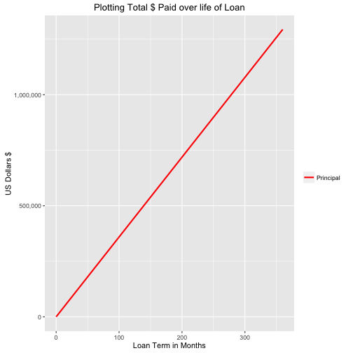

FinanceSlides
========================================================
author: Russell Bigley
date: 10/30/2016
autosize: true

The Finance Slides take user input
========================================================

For more documentation details: <https://github.com/rbpdqdat/R_Finance/blob/master/README.md>.

- Initial Loan Amount
- Annual Percentage Rate (APR)
- Initial Loan Amount (Principal)
- (optional) Additional Payments

Submit button runs the server calculations based on the user input.

Calculations
========================================================
montly payment function

function(p,r,n) p * (r/100/12 * (1 + r/100/12) ** n) / ((1 + r/100/12) ** n - 1)

- p - initial loan  250,000
- r - rate  4.5%
- n - number of months of loan  360

```r
monthlypmt <-function(p,r,n) p * (r/100/12 * (1 + r/100/12) ** n) / (1 + r/100/12)
                                                                    
monthlypmt(250000,4.5,360)
```

```
[1] 3593.74
```

Graph Total Principal Paid
========================================================

This runs a simulation with the above data filled to the monthly payment formula.



Additional Work
========================================================

The app is expected to undergo additional development. To determine if extra $ should be invested into the load payment, or if it might be a better strategy to put that money into an investement account. The differences in the strategies will create financial guidance. Another factor that will be included is the equity that could be tapped into if the asset that is the basis of the loan grows/shrinks in value. This could be the basis for financial risk strategies when a series of random walk assigments are used.
